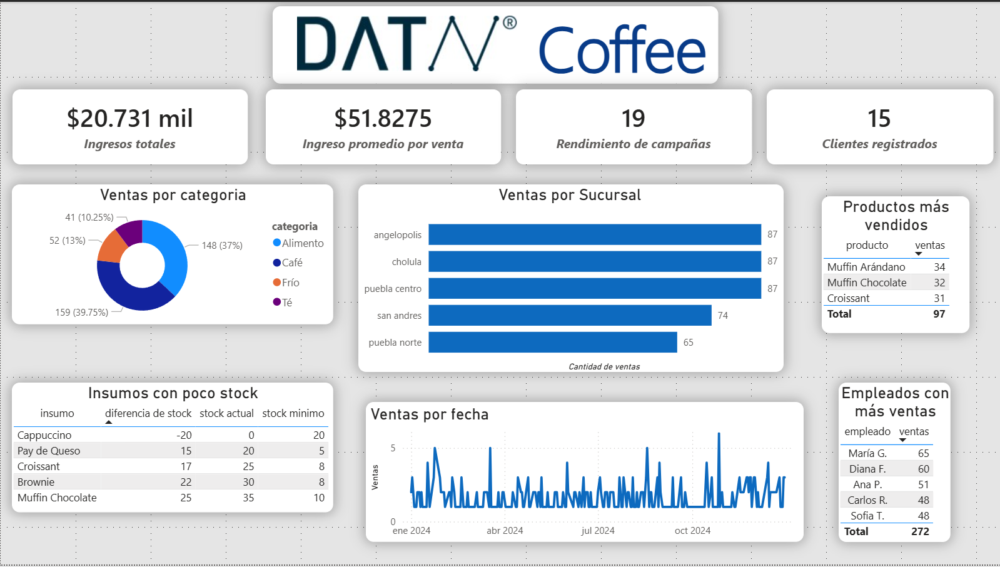

# Prueba Técnica - DATAV

En este repositorio muestro mi procedimiento de como entiendo y analizo los datos, con el objetivo de apoyar en las decisiones coorporativas.
Parte de una prueba que se me implemento con el objetivo de que los colaboradores de "DATAV" puedan observar y analizar mis habilidades y desempeño.

## Estructura del repositorio

El proyecto está desarrollado principalmente en **Jupyter Notebooks** para poder documentar, comentar y justificar cada paso del proceso de manera clara.

*   `inspeccion`: Contiene 5 notebooks dedicados al Análisis Exploratorio de Datos (EDA). Aquí se detalla el planteamiento inicial para entender la naturaleza y calidad de los datos.
*   `limpieza`: Contiene el procesamiento y transformación de cada tabla. El objetivo de esta fase fue crear una base de datos sólida, homogénea y confiable para facilitar el análisis.
*   `utils`: Archivo con funciones auxiliares que optimizan y hacen más cómoda la inspección de las tablas.

## Replicar el flujo de trabajo

Para replicar el análisis que realicé, se tienen que seguir los siguientes pasos: 

1. **Clonar el repositorio**: con el comando: ```git clone https://github.com/EdilbertoAntonio/prueba_tecnica.git```
2. **Crear un entorno virtual**: para evitar conflictos de dependencias, con: ```python -m venv venv``` y posteriormente: ```venv\Scripts\activate```
3. **Instalar las dependencias**: con el comando: ```pip install -r requirements.txt```

> [!NOTE]
> De preferencia abrir los cuadernos desde la extensión de Jupyter Notebooks en `VScode`.

4. **Preparar los datos**: tener las 5 bases de datos originales en la raíz del proyecto, es decir, no otras carpetas.
5. **Ejecutar inspección**: correr todas las celdas de cada notebook de la carpeta `inspeccion`.
6. **Ejecutar inspección**: correr todas las celdas de cada notebook de la carpeta `limpieza`, con la consideración que se ejecute primero la notebook de `limpieza_productos` y después la notebook de `limpieza_inventario`
7. **Visualización**: abrir el archivo de Power BI para visualizar el dashboard conectado a los datos limpios resultantes.

## Dashboard y principales resultados.

Para mayor comodidad, aquí presento una vista previa del Dashboard ejecutivo:



Conclusiones: 
- Ingresos acumulados: las ventas totales desde la apertura de la compañía hasta el último registro ascienden a $20,731 pesos.
- Mejores categorías: la categoría líder en ventas es café, seguida muy de cerca por alimentos.
- Mejor producto: los Muffins son el producto más consumido, lo que es un excelente indicador de la calidad de nuestro proveedor actual.
- Mejor empleado: la colaboradora con el mejor desempeño en ventas es María G.

## Áreas de mejora

Es un repositorio donde se enfocó un en explicar el procedimiento más que la optimización, por lo que claramente la mayor área de mejora es optimizar el procesamiento de la limpieza de los datos, ya que, no es una limpieza robusta, y sólo funciona para los datos que fueron proporcionados, por lo que para nuevos, puedan generar errores y/o resultados incorrectos, además de que se puede modularizar más el codigo, ya que hay ciertas secciones de código que se repiten en varias notebooks.

### Tecnologias usadas

*   **Python** (Pandas y Numpy)
*   **Jupyter Notebooks**
*   **Power BI** (Visualización)
